# Reading Notes Repo for Code Fellow 201-401

 Hello All, this is my repo of notes for code fellows *** 201 through 401 ***, from basic to intermediate to advacnced programming. 
I Hope that By having these notes, I can help both you and I with any issues or observations I make through this learning journal.

## 102 Reading Notes

## 201 Reading Notes - Basic software Defelopment

1. Class 01 notes

2. [Class 02 notes](201class-02.md) 

3. [Class 03 notes](class-03.md)

4. [Class 04 notes](class-04.md)

5. [Class 05 Notes](class-05.md)

7.[class 07 ](class-07.md)

8.[class-13](class13.md)

9.[Class-14-a](class14a.md)

10.[class-14-b](class14b.md)

## 301 reading Notes-Intermediate Software Development

1.[301read01.md](301read01.md) 

2.[302read02.md](301read02.md) 
3.[301read03.md](301read03.md) 

4.[301read04.md](301read04.md) 
5.[301read05.md](301read05.md) 
6.[301read06.md](301read06.md) 
7.[301read07.md](301read07.md) 
8.[301read08.md](301read08.md) 
9.[301read09.md](301read09.md) 
10.[301read10.md](301read10.md) 
11.[301read11.md](301read11.md) 
12.[301read12.md](301read12.md) 
13.[301read13.md](301read13.md) 
14.[301read14.md](301read14.md) 
15.[301read15.md](301read15.md)

## 401 Reading Notes-Advanced Software Development-Python
1.[401read01.md](401read01.md) 
2.[401read02.md](401read02.md) 

3.[] 
4.[401read04.md](401read04.md)

6.[401read06.md](401read06.md)

7.[401read07.md](401read07.md)

8.[401read08.md](401read08.md)

9.[401read09.md](401read09.md)

11.[401read11.md](401read11.md)

12.[401read12.md](401read12.md)

13[401read13.md](401read13.md)

## SQL Notes so far. 
[https://sqlbolt.com/] 
[https://www.codecademy.com/article/what-is-rdbms-sql]
[https://www.oracle.com/database/what-is-a-relational-database/]

### What is #SQL?

SQL (structured query language) designed to allow users to easily access data from a relational DB

### What is a relational DB?
A Relational DB uses structure to relate data in the DB to other data, allowing us to acces data based on how it related to other data in the database. 

- this is often stored in tables.

#### Examples of some popular raltional DB management systems

#MySQL
	- most popular open source DB. 
	- easy to use
	- large community
	- can suffer poor performance when scaling. 

#oracle_db 
	- not open source
	- commonly used in banking
	- can be very expensive
	
#SQL_Server
	- owned by microsoft
	- not open source

#SQLite
	- open source
	- can store entire DB in a single file
	

  ### Proof of completion 

  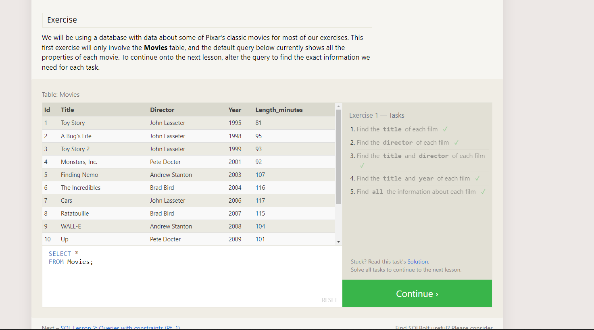
  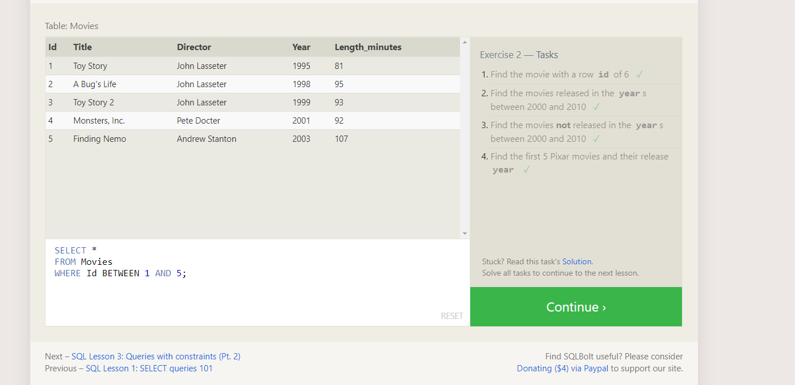
  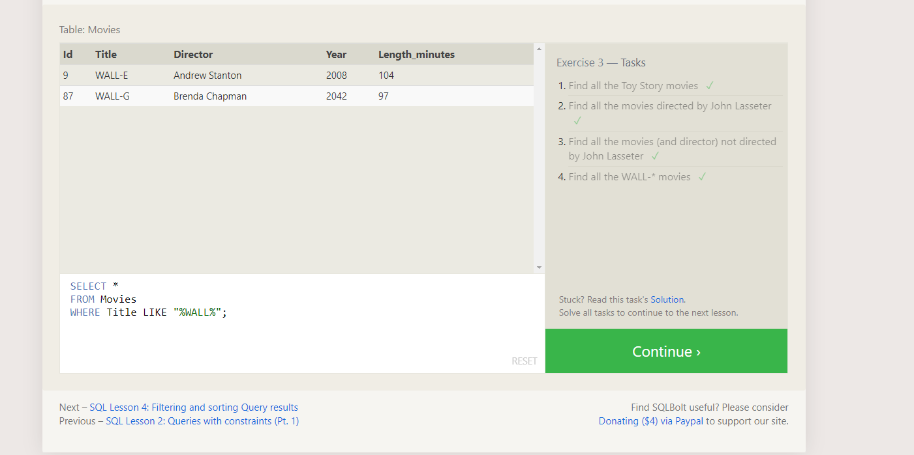
  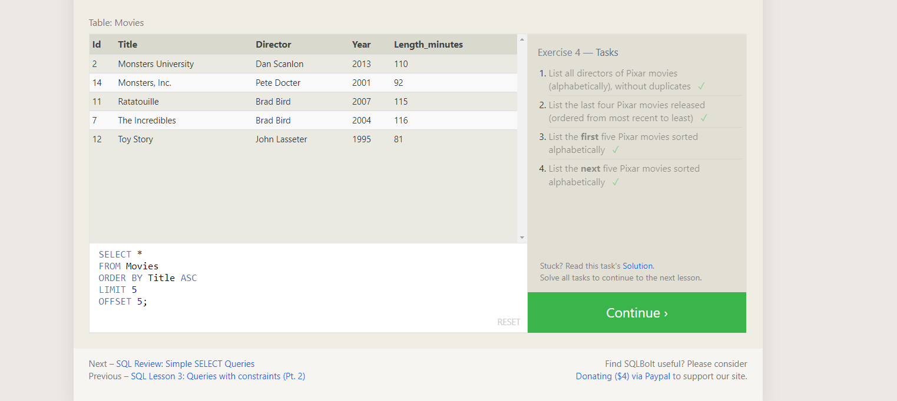
  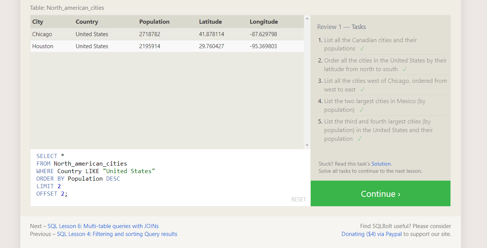
  
  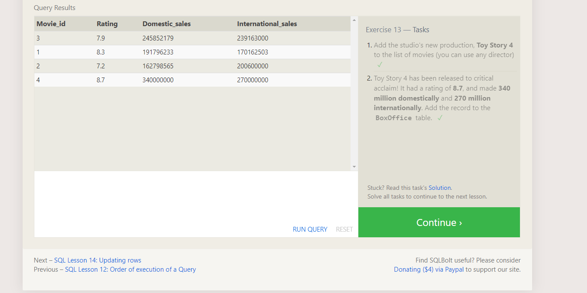
  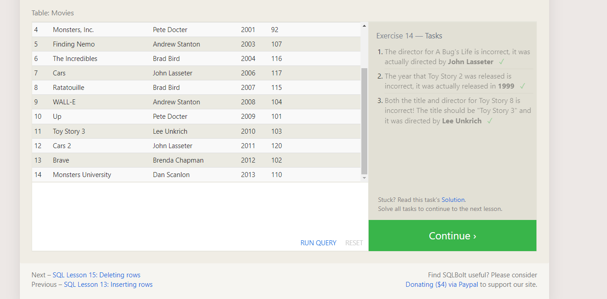
  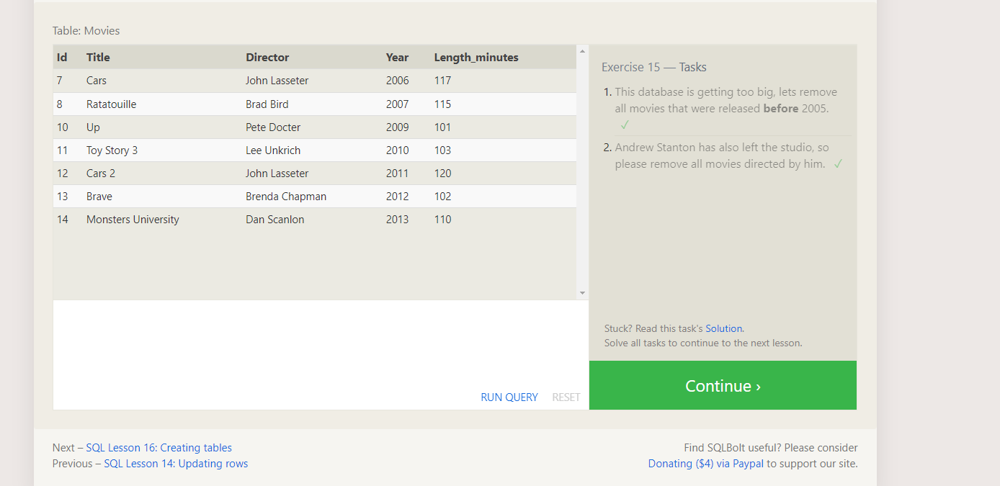
  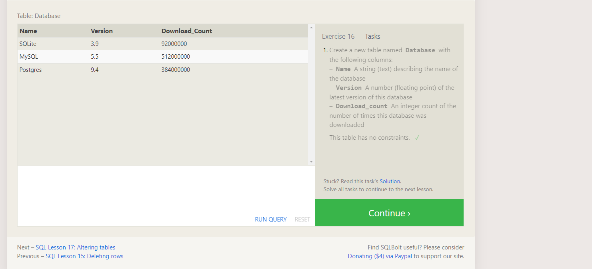
  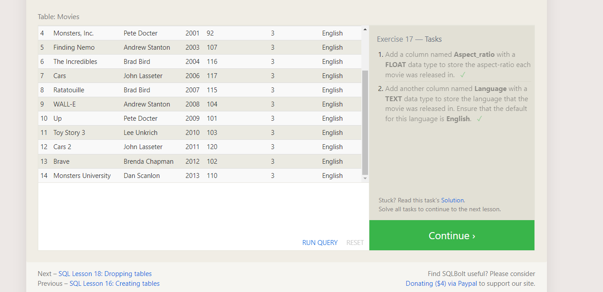
  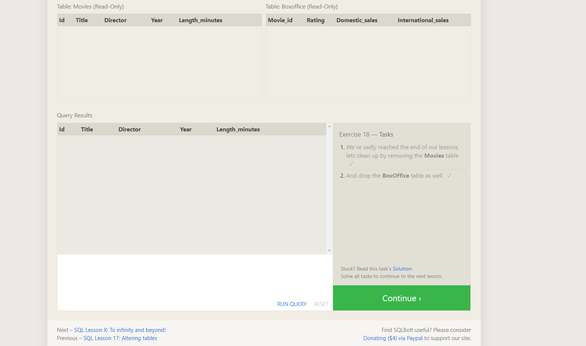

  ### Terminal 

  [Terminal-commands](./Terminal.md)